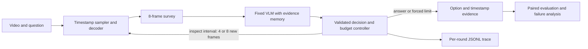

# Watch Wisely
### Budget-Aware Adaptive Frame Selection for Video Question Answering

Most frames in a long video are not useful for answering a particular question. But if we
sample too few frames at fixed intervals, we might miss the one short event that matters.

The idea here is simple: start with 8 frames, let the model decide where to look next, and
stop after at most 24 frames. I want to test whether this works better than choosing all
24 frames in advance, and whether any improvement is worth the extra model calls.

**Work in progress. No benchmark results yet.**
So far, the code can choose timestamps, enforce the frame and round limits, and check when
the agent is allowed to stop. There is also a small test run using made-up inputs.
The video reader can now return selected frames, reject repeats, and resize them to a 448-pixel
long side. The model connection, CLIP encoder and evaluation scripts still need to be built.
Model decisions now have a strict JSON parser that rejects malformed requests and references
to unseen timestamps. See [the action format](docs/actions.md).
The [model-call wrapper](docs/model_calls.md) now limits calls and records rejected decisions.
It has only been tested with scripted responses so far.

I'm **Peng Yi Cheng (PYCHS)**. This repo builds on our NCKU Group 128 course proposal by
劉邦佑、蔡源慶、彭以呈、部政佑. See [provenance](docs/proposal.md).
This is an ongoing course project. The proposal is not a published paper.

## What I want to find out

- Does choosing where to look next help when both methods can see at most 24 frames?
- Can the agent answer some questions with fewer frames without losing much accuracy?
- How much extra time and how many extra model calls does it need?
- When it gets an answer wrong, did it miss the event, look in the wrong place, or stop too early?

## Planned setup

| Component | Planned setting |
|---|---|
| Main backbone | Qwen/Qwen3-VL-8B-Instruct, frozen checkpoint/processor |
| Survey | 8 evenly spaced frames |
| Tools | `inspect(start, end, k)` with k in {4, 8}; `answer(option, evidence)` |
| Limits | 24 unique frames; 4 observation/decision rounds including survey |
| Early stop | Valid option, observed evidence timestamps, no missing evidence, confidence >= 0.80 |
| Inputs | Timestamped image-text pairs, 448-pixel long side; no audio/subtitles |
| Comparators | Uniform-8/16/24; fixed CLIP ViT-B/32 coarse-to-fine 8+16 |
| Ablation | Always-use-24 adaptive selection |
| Dataset | Target 100 screened Video-MME questions, balanced medium/long when available |
| Sensitivity | Fixed 20-question pilot, Qwen2.5-VL-7B-Instruct, Uniform-24 vs Adaptive-24 |

The 0.80 confidence threshold is just a rule for stopping. It does not mean the model has
an 80% chance of being right.

## How it works



Only selected frames reach the VLM, never the complete video. See [architecture](docs/architecture.md),
[evaluation](evaluation/README.md), and [reproducibility](docs/reproducibility.md).

## Quick start: CPU-only foundation

Python 3.11 or 3.12 is recommended. No model weights, GPU, or dataset are needed.

```sh
python -m venv .venv
# Linux/macOS: source .venv/bin/activate
# PowerShell: .venv\Scripts\Activate.ps1
python -m pip install -e .
python -m unittest discover -s tests -v
python scripts/smoke.py
python scripts/check_configs.py
```

The smoke command prints a **synthetic controller trace**, not a model answer or research result.
Inference dependencies are a separate, unvalidated [environment skeleton](requirements/inference.txt).
Successful unit tests do not establish model or dataset compatibility.

To try the video reader and run its tests, install `python -m pip install -e ".[video]"`.
See [reading frames](docs/video_reader.md) for an example and current limits. The reader is
not connected to the agent loop yet.

## Repository layout

```text
src/watch_wisely/  sampling, controller, backend interface, trace schema
configs/          protocol settings and pilot specification (JSON)
scripts/          offline checks and synthetic smoke run
evaluation/       planned evaluation and statistical analysis
docs/             architecture, provenance, reproducibility, data screening
requirements/     optional inference environment skeleton
tests/            budget, rejection, evidence and sampling invariants
```

## Results (not run yet)

| Method | Frame ceiling | Accuracy | Mean frames | Latency / tokens |
|---|---:|---|---|---|
| Uniform-8 | 8 | pending | pending | pending |
| Uniform-16 | 16 | pending | pending | pending |
| Uniform-24 | 24 | pending | pending | pending |
| Fixed CLIP coarse-to-fine | 24 | pending | pending | pending |
| Adaptive-24 | 24 | pending | pending | pending |
| Adaptive always-use-24 | 24 | pending | pending | pending |

I'll count it as an accuracy gain only if the paired 95% confidence interval is entirely above
zero. For similar accuracy with fewer frames, the lower bound must be at least -2 percentage
points and the average frame count must be lower. If neither happens, that is still a result
to report.

## Development

[ROADMAP.md](ROADMAP.md) lists the next steps. I plan to build this a piece at a time and check
each piece before moving on. Next is connecting frame reading and decisions into one loop,
then trying the real model.

## Primary resources

- [Qwen3-VL model card](https://huggingface.co/Qwen/Qwen3-VL-8B-Instruct)
- [Qwen3-VL implementation](https://github.com/QwenLM/Qwen3-VL)
- [Video-MME benchmark](https://github.com/MME-Benchmarks/Video-MME)
- [CLIP ViT-B/32](https://huggingface.co/openai/clip-vit-base-patch32)
- [Qwen2.5-VL pilot backbone](https://huggingface.co/Qwen/Qwen2.5-VL-7B-Instruct)

Model and dataset licenses remain separate. No weights, videos, or credentials are included.
A code redistribution license has not yet been selected by the team.
